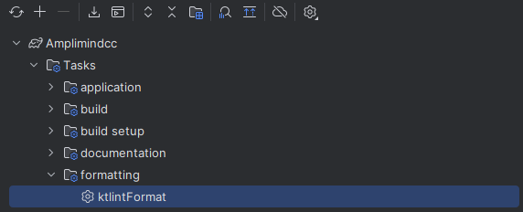
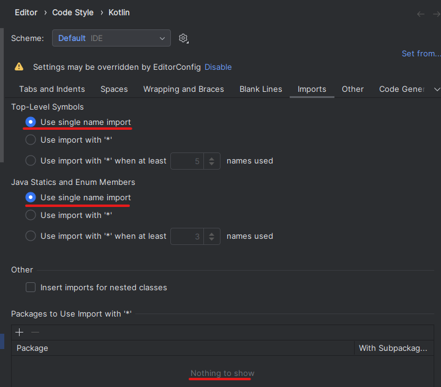
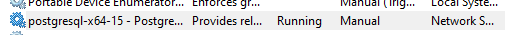
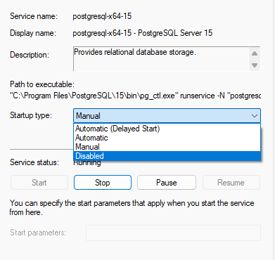

# Needed software
- Docker
- JDK21

# Run the application
- Run CodingChallengeApplication#main

# Linting
This project uses Klint to format the code and check for formatting errors.

Run the following gradle task in order to run the linter:

## Wildcard imports
The linter will abort with an error if wildcard imports are used. Sadly intellij does those import automatically.
To fix this, go to the settings and search for "Imports" and disable the option "Use single class import".

# See all the endpoints
- Run the application and go to http://localhost:8080/swagger-ui/index.html

# Toubleshooting

## Postgres
Fehler: `Caused by: org.postgresql.util.PSQLException: FATAL: password authentication failed for user "postgres"`

Behebung (Windows):
 - Win + R
 - `services.msc` eingeben und Enter drücken
 - Nach postgres suchen 
 - Rechtsklick -> Eigenschaften
 - Disablen und Stoppen: 
 - Backend neustarten

 Docker (Backend):
 - Im Hauptordner, wo sich Dockerfile befindet, Terminal öffnen
 - Docker für Desktop muss laufen
 - docker-compose up --build
